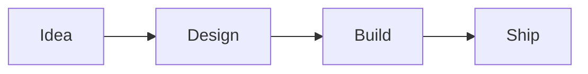
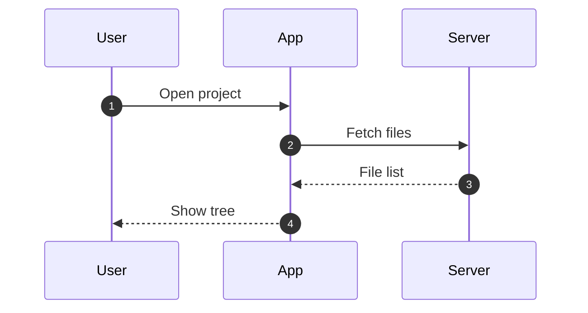
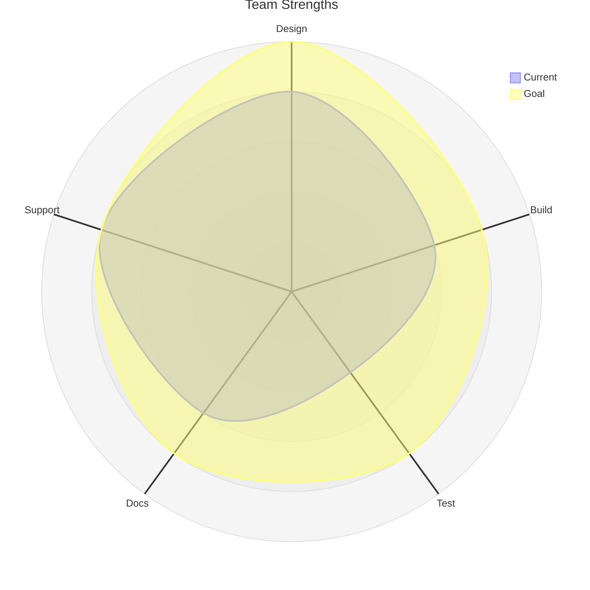
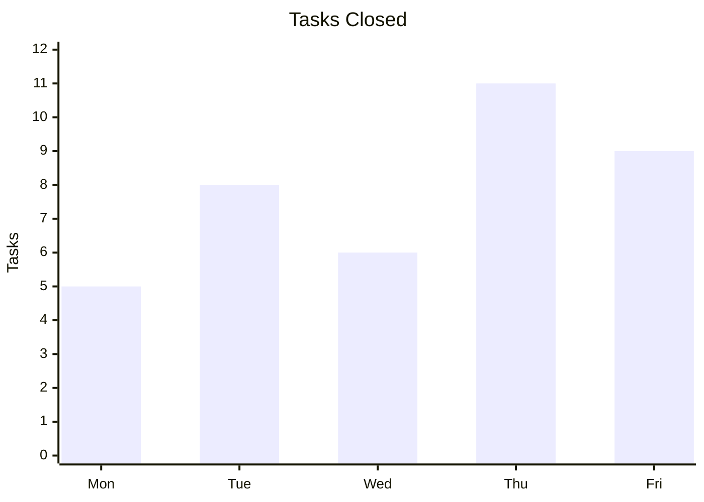
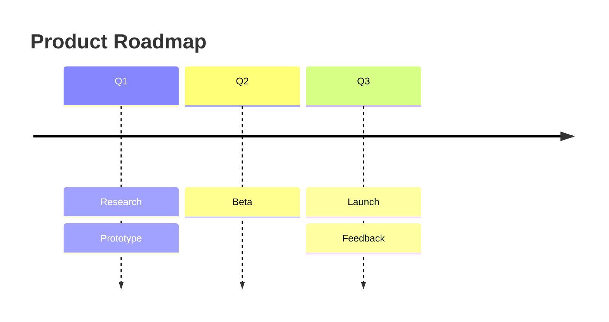
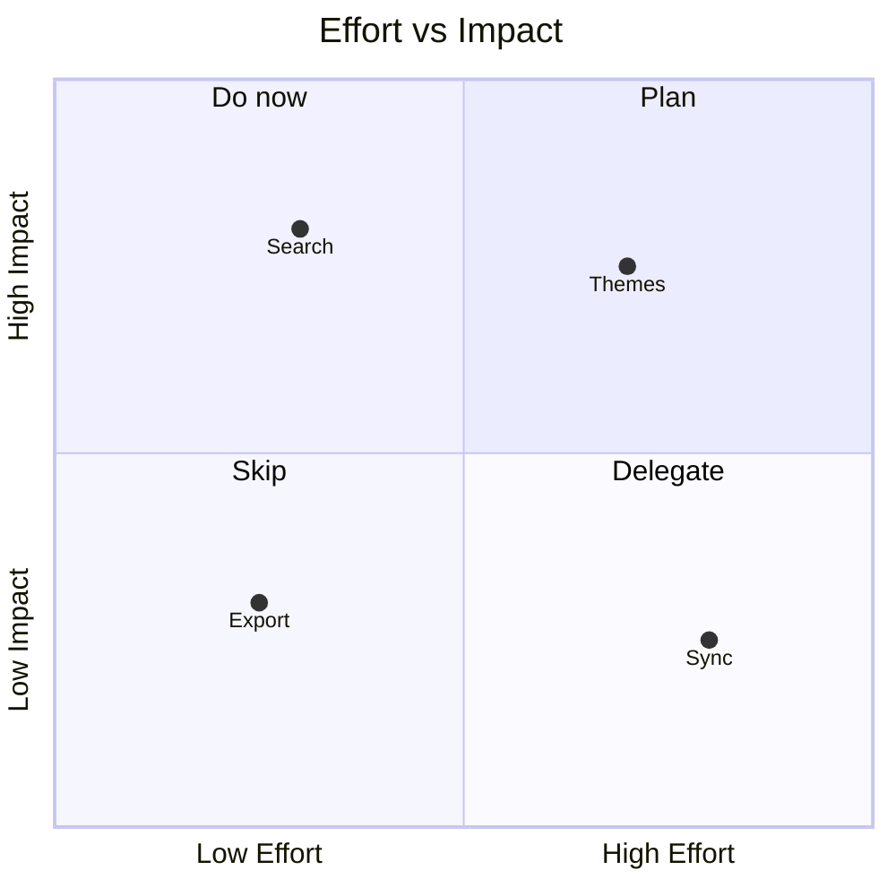
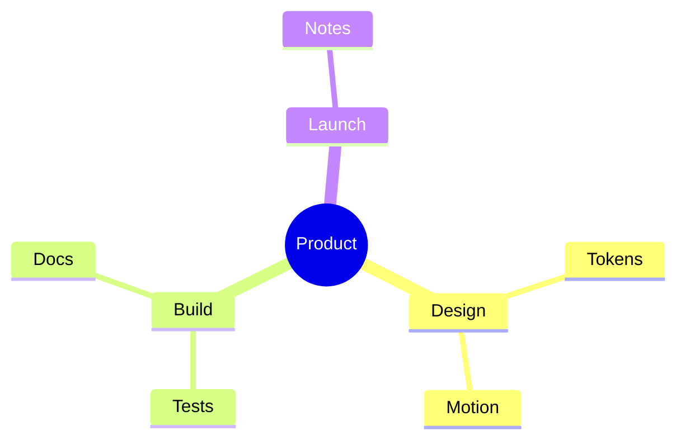

# Diagram Gallery

Mermaid blocks in this document render as interactive diagrams in Preview.

## Flow

```mermaid
flowchart LR
  A[Idea] --> B[Design] --> C[Build] --> D[Ship]
```

## Sequence

```mermaid
sequenceDiagram
  autonumber
  participant U as User
  participant A as App
  participant S as Server
  U->>A: Open project
  A->>S: Fetch files
  S-->>A: File list
  A-->>U: Show tree
```

## Skills

```mermaid
radar-beta
  title Team Strengths
  axis d["Design"], b["Build"], t["Test"], w["Docs"], s["Support"]
  curve a["Current"]{4, 3, 2, 3, 4}
  curve g["Goal"]{5, 4, 4, 4, 4}
  max 5
```

## Weekly Output

```mermaid
xychart-beta
  title "Tasks Closed"
  x-axis [Mon, Tue, Wed, Thu, Fri]
  y-axis "Tasks" 0 --> 12
  bar [5, 8, 6, 11, 9]
```

## Roadmap

```mermaid
timeline
  title Product Roadmap
  Q1 : Research : Prototype
  Q2 : Beta
  Q3 : Launch : Feedback
```

## Priorities

```mermaid
quadrantChart
  title Effort vs Impact
  x-axis Low Effort --> High Effort
  y-axis Low Impact --> High Impact
  quadrant-1 Plan
  quadrant-2 Do now
  quadrant-3 Skip
  quadrant-4 Delegate
  Search: [0.3, 0.8]
  Themes: [0.7, 0.75]
  Export: [0.25, 0.3]
  Sync: [0.8, 0.25]
```

## Topics

```mermaid
mindmap
  root((Product))
    Design
      Tokens
      Motion
    Build
      Tests
      Docs
    Launch
      Notes
```
